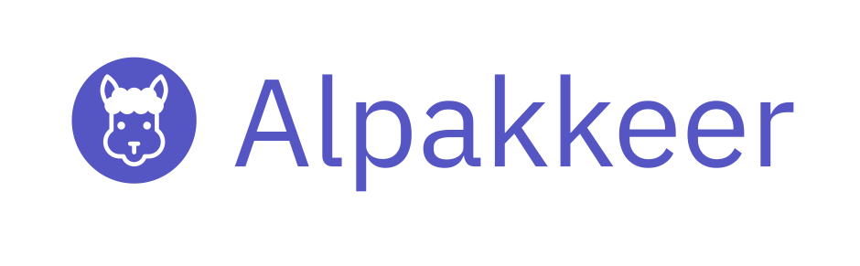

# Alpakkeer



<div style="text-align: center; font-style: italic">
Build, Run and Operate Akka Streams applications quickly, ready for production.
</div>

---
**Documentation:** [cokeschlumpf.github.io/alpakkeer](https://cokeschlumpf.github.io/alpakkeer/)<br />
**GitHub Repository:** [github.com/cokeSchlumpf/alpakkeer](https://github.com/cokeSchlumpf/alpakkeer)
---

Alpakkeer is an opinionated Java+Scala toolkit to build, run and operate light-weight integration applications based on [Akka Streams](https://doc.akka.io/docs/akka/current/stream/index.html) and [Alpakka](https://doc.akka.io/docs/alpakka/current/index.html).

Alpakkeer bundles various libraries and components:

* A Web Server based on [Javalin](https://javalin.io/) to provide simple access via REST APIs to manage Akka Streams processes and expose metrics to Prometheus and Grafana.
 
* Configuration Management based on [Lightbend Config](https://github.com/lightbend/config) including some extensions for environment-based configurations and automatic mapping to POJOs.

* Prometheus Client to record application and stream metrics. Alpakkeer also provides custom FlowStages to argument your stream with Akka Streams specific metrics.

* Abstracted building blocks to compose streams based on [Alpakka](https://doc.akka.io/docs/alpakka/current/index.html).

* An easy to use DSL for Java and Scala to compose applications.

## Getting Started

Add the dependency:

=== "Maven"

    ```xml
    <dependency>
        <groupId>io.github.cokeschlumpf</groupId>
        <artifactId>alpakkeer-core</artifactId>
        <version>0.0.1-SNAPSHOT</version>
    </dependency>
    ```

=== "Gradle"

    ```groovy
    compile group: 'io.github.cokeschlumpf', name: 'alpakkeer-core', version: '0.0.1-SNAPSHOT'
    ```

=== "SBT"

    ```scala
    libraryDependencies += "io.github.cokeschlumpf" %% "alpakkeer-scaladsl" % "0.0.1-SNAPSHOT"
    ```

To use the latest snapshot version, add the snapshot repository to your configuration:

=== "Maven"

    ```xml
    <repositories>
        <repository>
            <id>sonatype-oss</id>
            <name>Sonatype OSS Repository</name>
            <url>https://oss.sonatype.org/content/repositories/snapshots</url>
        </repository>
    </repositories>
    ```

=== "Gradle"

    ```groovy
    repositories {
        jcenter()

        maven {
            url "https://oss.sonatype.org/content/repositories/snapshots"
        }
    }
    ```

=== "SBT"

    ```scala
    resolvers += "Sonatype OSS Snapshots" at "https://oss.sonatype.org/content/repositories/snapshots"
    ```

Start coding

=== "Java"

    ```java
    import akka.stream.javadsl.Keep;
    import akka.stream.javadsl.Sink;
    import akka.stream.javadsl.Source;
    import alpakkeer.core.scheduler.model.CronExpression;
    import alpakkeer.javadsl.Alpakkeer;

    public class HelloAlpakkeer {
        public static void main(String ...args) {
            Alpakkeer.create()
                .withJob(jobs -> jobs
                    .create("hello-world")
                    .runGraph(b -> Source
                        .single("Hello World")
                        .toMat(Sink.foreach(System.out::println), Keep.right()))
                .withScheduledExecution(CronExpression.everySeconds(10))
                .withLoggingMonitor())
                .start();
        }
    }
    ```

=== "Scala"

    ```scala
    import akka.stream.scaladsl.{Keep, Sink, Source}
    import alpakkeer.core.scheduler.model.CronExpression
    import alpakkeer.javadsl.Alpakkeer

    object HelloAlpakkeer extends App {
        Alpakkeer.create()
            .withJob(b => b
                .create("hello-world")
                .runGraph(Source
                    .single("Hello World!")
                    .toMat(Sink.foreach(println))(Keep.right)
                    .asJava)
                .withLoggingMonitor()
                .withScheduledExecution(CronExpression.everySeconds(10)))
            .start()
    }
    ```


## Requirements

Java 11+, Scala 2.13

Alpakkeer runs on: Akka 2.6.4+, Akka Streams 2.6.4+, Javalin 3.8.0

## License

This project is licensed under the terms of the Apache 2.0 License.